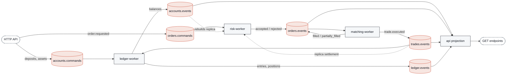
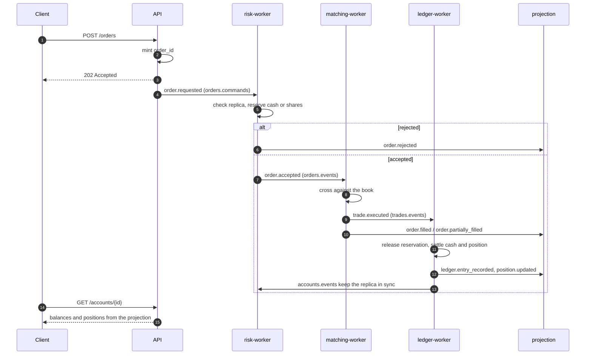
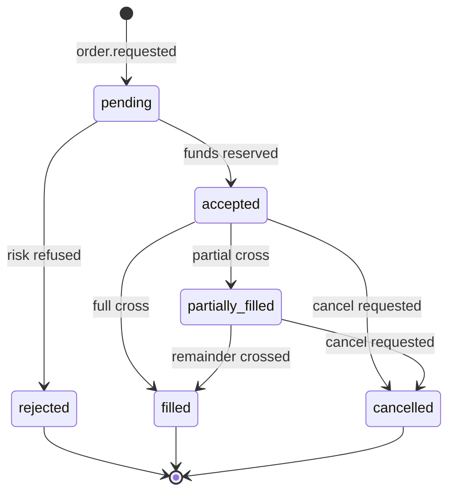

# Architecture notes

## Diagrams

Mermaid blocks: they render on GitHub, VS Code, Obsidian and any Markdown viewer with mermaid support.

### Topology



Topics are the only integration point: no service calls another service directly.

### Order lifecycle



### Order status



## Topics

| Topic | Key | Written by | Read by |
| --- | --- | --- | --- |
| `trading.accounts.commands` | `account_id` | api, seed | ledger-worker |
| `trading.accounts.events` | `account_id` | ledger-worker | risk-worker, api |
| `trading.orders.commands` | `account_id` / `symbol` | api, seed | risk-worker, matching-worker |
| `trading.orders.events` | `symbol` / `account_id` | risk-worker, matching-worker | matching-worker, risk-worker, api |
| `trading.trades.events` | `symbol` | matching-worker | ledger-worker, risk-worker, api |
| `trading.ledger.events` | `account_id` | ledger-worker | api |
| `trading.dead.letter` | source key | reserved | — |

## Event catalog

### Commands

| Type | Payload |
| --- | --- |
| `account.open_requested` | `account_id`, `owner`, `base_currency` |
| `account.deposit_requested` | `account_id`, `currency`, `amount` |
| `account.withdraw_requested` | `account_id`, `currency`, `amount` |
| `account.credit_asset_requested` | `account_id`, `symbol`, `quantity`, `price` |
| `order.requested` | `order_id`, `account_id`, `symbol`, `side`, `order_type`, `quantity`, `price`, `currency` |
| `order.cancel_requested` | `order_id`, `symbol` |

### Events

| Type | Payload |
| --- | --- |
| `account.opened` | `account_id`, `owner`, `base_currency` |
| `account.funds_deposited` / `account.funds_withdrawn` | `account_id`, `currency`, `amount`, `available`, `reserved` |
| `account.assets_credited` | `account_id`, `symbol`, `quantity`, `reserved`, `average_price`, `credited_quantity`, `price` |
| `account.command_rejected` | `command`, `reason`, `payload` |
| `order.accepted` / `order.rejected` | order snapshot (+ `reason` when rejected) |
| `order.partially_filled` / `order.filled` | order snapshot with `filled_quantity` |
| `order.cancelled` | `order_id`, `symbol` |
| `trade.executed` | `trade_id`, `symbol`, `price`, `quantity`, order ids, account ids, `taker_side` |
| `ledger.entry_recorded` | `account_id`, `trade_id`, `symbol`, `currency`, `amount`, `type` |
| `position.updated` | `account_id`, `symbol`, `quantity`, `reserved`, `average_price` |

## Envelope

Every message is JSON with the same envelope:

```json
{
  "event_id": "uuid",
  "type": "order.accepted",
  "key": "AAPL",
  "correlation_id": "uuid of the originating command",
  "occurred_at": "2026-09-14T12:00:00+00:00",
  "payload": {}
}
```

`correlation_id` is propagated from command to derived events, so a full flow can be traced
in Redpanda Console by filtering on it.

## Delivery semantics

- Producers: idempotent, `acks=all`.
- Consumers: manual commit after the handler succeeds — at-least-once, so handlers must
  tolerate reprocessing (the mock is not fully idempotent yet; see Next steps).
- Partitioning: account-keyed topics keep per-account ordering; symbol-keyed topics keep the
  book consistent per instrument, which is why the matching worker must own one symbol set.

## Money

`Decimal` everywhere, serialized as strings. Cash quantized to 2 decimals, quantities to 8.
Never floats.
